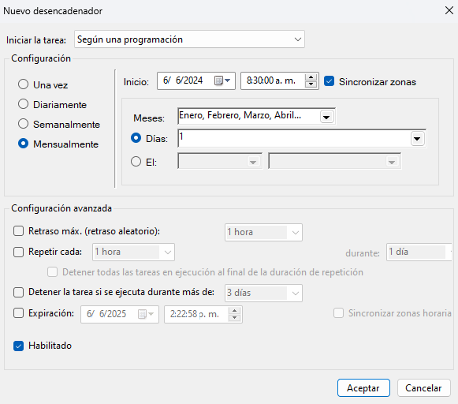

# Proyecto

## Funcionalidad

El programa ha sido desarrollado con la finalidad de recibir como parametros un archivo .sql para ejecutar el query que en el contiene y exportar esta informacion en un archivo .xlsx (Excel).

Esto se realiza usando como contenedor para los datos un objeto del tipo DataFrame proporcionado por la libreria Pandas.

## Módulos

**•Main.py**
    -Contiene la lógica para necesaria para leer los archivos .sql, obtener la información y luego su posterior exportación.
**•Connection.py**
    -Contiene la lógica necesaria para realizar la conexión a la base de datos únicamente de oracle.
**•config.py**
    -Sirve como archivo de configuración para establecer los parámetros necesarios para realizar la conexión a la base de datos.

## Configuración

•Rellenar la información en los campos del archivo "config.py" con los datos de tu conexión a la base de datos oracle y la ruta donde quedarán los resultados(.xlsx files).

• Colocar los archivos .Sql en la carpeta "Queries".

Deberia quedar algo como esto:

## Ejecución

Para ejecutar el script debemos utilizar el archivo "Main.py".

Una vez se ejecute el script deberiamos obtener algo como esto:

Y la creación de la carpeta donde se almacenaran los reportes en formato .xlsx

# Calendarización

## Archivo .bat

Lo primero que debemos de tener para programar este scrip a una tarea para que se ejecute automáticamentes es crear el archivo .bat. Para ello debemos de crear el archivo dentro de la ruta del proyecto y escribir este código.

@echo off
cd /d %~dp0
python Mail.py
pause

Quedandonos algo como esto.

## Programación de tarea

• Abrimos el Programa Task Scheduler o Programador de Tarea

• Elejimos la opción "Crear tarea básica".

• Le colocamos unn nombre y una descripción.

• Colocamos un Desencadenador o trigger. Elegimos uno nuevo y en este caso sería el mensualmente, el dia 1 de cada mes.

• En el apartado de acciones colocamos una nueva. Será iniciar un programa donde haremos referencia a la ubicación donde tenemos nuestro archivo .bat.

• Si desea, puede realizar otras configuraciones en el apartado de "Configuración" y "Condiciones".

• Finalmente pulsamos "Aceptar" para dejar todo listo y que el codigo se ejecute según las condiciones previamente establecidas.
